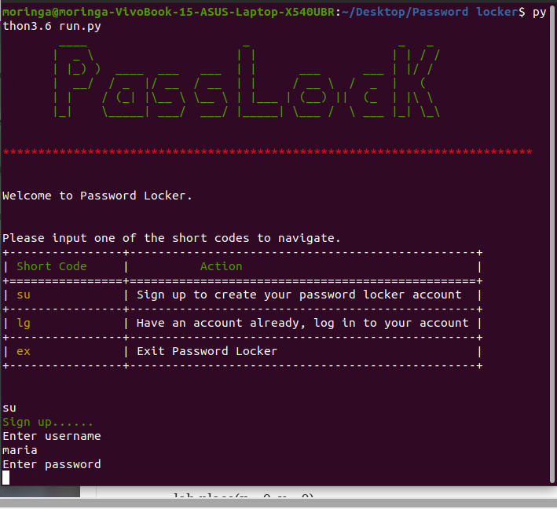

# PasswordLocker
#### By Mary Njenga
## Table of Content
+ [Description](#description)
+ [Behaviour Driven Development](#Behaviour-Driven-Development)
+ [Installation Requirement](#Installation)
+ [Technology Used](#technology-used)
+ [Licence](#licence)
+ [Authors Info](#authors-info)

****
## Description
An application that helps the user manage passwords of various accounts and also help user to generate new passwords,find and delete stored account login details.


#### Before


## Behaviour Driven Development
| Behaviour      | Input     | Output     |
| :------------- | :----------: | -----------: |
|  Wrong short code    | User enters wrong short code | An error is message is displayed    |
|  Valid code    | User enters a  valid code   | action is executed |
|  su   | User enters short code su  | User is prompted to create a passlock account|
|  lg   | User enters short code lg  | User is prompted to log in to passlock account|
|  ex   | User enters short code ex  | Exits password locker system|
|  cc   | User enters short code cc  | User is prompted to create new credential|
|  fc   | User enters short code fc  | User can serach for a credential|
|  dc   | User enters short code dc  | Created  credentials are displayed|
|  dl   | User enters short code dl  | User is enters account name of credential to delete|
|  lo   | User enters short code lo  | User is logged out of the account|

****
## Installation
### Requirements
* python3.6
* pip 

### Package Installation Process
* python3.6 -m pip install tabulate
* python3.6 -m pip install termcolor

### Running the Application
    ```
    $ chmod +x run.py
        ./run.py
        
        ```
[Go Back to the top](#PasswordLocker)
## Technology Used
* Python

****
[Go Back to the top](#PasswordLocker)
## Licence
MIT License

Copyright (c) 2021 Mary Njenga

Permission is hereby granted, free of charge, to any person obtaining a copy
of this software and associated documentation files (the "Software"), to deal
in the Software without restriction, including without limitation the rights
to use, copy, modify, merge, publish, distribute, sublicense, and/or sell
copies of the Software, and to permit persons to whom the Software is
furnished to do so, subject to the following conditions:

The above copyright notice and this permission notice shall be included in all
copies or substantial portions of the Software.

THE SOFTWARE IS PROVIDED "AS IS", WITHOUT WARRANTY OF ANY KIND, EXPRESS OR
IMPLIED, INCLUDING BUT NOT LIMITED TO THE WARRANTIES OF MERCHANTABILITY,
FITNESS FOR A PARTICULAR PURPOSE AND NONINFRINGEMENT. IN NO EVENT SHALL THE
AUTHORS OR COPYRIGHT HOLDERS BE LIABLE FOR ANY CLAIM, DAMAGES OR OTHER
LIABILITY, WHETHER IN AN ACTION OF CONTRACT, TORT OR OTHERWISE, ARISING FROM,
OUT OF OR IN CONNECTION WITH THE SOFTWARE OR THE USE OR OTHER DEALINGS IN THE
SOFTWARE.


****
[Go Back to the top](#PasswordLocker)
## Authors Info
* Slack Profile - [Mary Njenga](https://app.slack.com/client/T077KKCG6/GLRQR61NW/user_profile/U027VKL1WLT?cdn_fallback=1)
* Email - [Mary Njenga](mary.njenga@student.moringaschool.com)

[Go Back to the top](#PasswordLocker)
